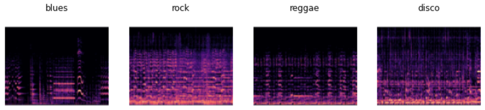

# music-genre-classification

Web app: https://paolocosenza-music-genre-classifica-genre-classification-vdc16o.streamlit.app/

Web application project containing a simple music genre classifier trained on the spectrograms of the <a href=https://www.kaggle.com/datasets/andradaolteanu/gtzan-dataset-music-genre-classification> GTZAN Dataset</a>. It takes the URL of a YouTube song, converts the audio into a spegtrogram image and classifies its genre thanks to computer vision.

<h3>How does it work?</h3>
Neural network-backed computer vision can be used to recognize patterns and similarities in music spectrograms as well.
By converting a YouTube song into a spectrogram that has the same features of those contained in the GTZAN Dataset, we can make predictions about its genre.
 
 

