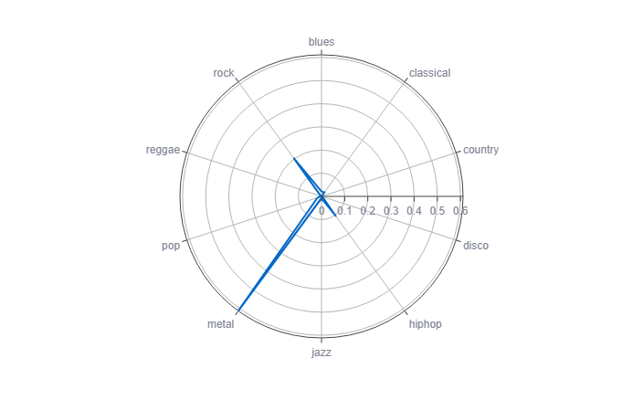

# Music genre classification

CNN-based music genre classifier trained on the spectrograms of the <a href=https://www.kaggle.com/datasets/andradaolteanu/gtzan-dataset-music-genre-classification> GTZAN Dataset</a>. It takes the URL of a YouTube song, converts the audio into a spegtrogram image and classifies its genre thanks to computer vision.

<h3>How does it work?</h3>
Neural network-backed computer vision can also be used to recognize patterns and similarities in music spectrograms.
By converting a YouTube song into a spectrogram that has the same features of the ones contained in the GTZAN Dataset, we can make predictions about its genre.

[Web application made with Streamlit](https://paolocosenza-music-genre-classifica-genre-classification-4un75w.streamlit.app/)

 
 

